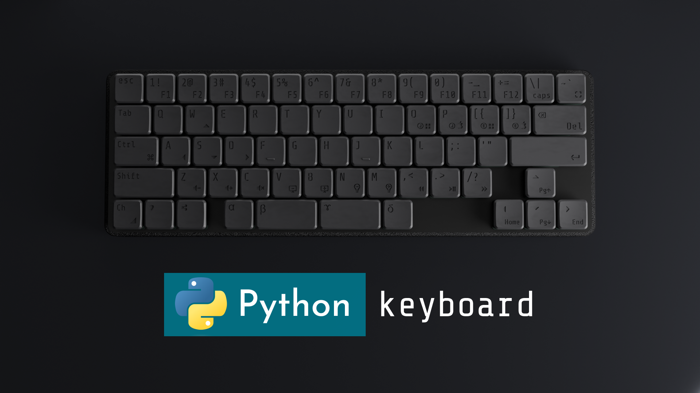

# EN_prototype_keyboard_Low64_16mm

# Project purpose

# What is this?

The best toy for people who can code Python (Raspberry Pi) gadget with keyboard and LED

# Can be used as a keyboard
This gadget has a set of functions that can be used as a keyboard.

# Freely customizable

By coding in python, you can use it freely, such as changing the key layout or launching any application with a single button.

# How to use it ?

Can be used as a keyboard by simply pointing at the USB cable

You can input each function key by long-pressing the Change key at the bottom left.

# How to customize keyboard ?
This keyboard runs using CuircuitPython - KMK firmware. For more information, please refer to the document linked below.

https://kmkfw.io

# How to use

When you connect the keyboard to the PC, a USB folder called CIRCUITPY will be recognized.

You can freely customize the keyboard by editing code.py inside that folder.

**Never delete or edit files other than code.py. It becomes unusable.**
**We recommend that you always take a backup before editing code.py.**

# I want to change the keymap from qwerty to Dovrak etc.
## keycode cheatsheet
https://kmkfw.io/keycodes/

https://kmkfw.io/media_keys/

Please change the code inside code.py referring to the above site.

# Sample code LED flash
**We recommend that you always back up your original code before editing code.py.**

You can perform LED flash by overwriting the code as shown in the image above.

# Product concept

The key pitch of the existing keyboard is set to 19mm. If you have short fingers, this key pitch will put a lot of strain on your fingers.

This mechanical keyboard has a key pitch of 16 mm, which is similar to that of a laptop, to reduce the strain on the fingers when typing, allowing even people with small hands to input keys without strain.

There are almost zero mechanical keyboards with a key pitch of 16mm, and as of 2024, there are almost no such products.

Please take this opportunity to consider the de facto standard key design, 16mm keypich mechanical keyboard.

# USB-C

dopts TYPE-C

# 16mm key pitch

Existing mechanical keyboards are made with a 19mm key pitch. This means that the distance between the keys is 19mm. This keyboard uses a 16mm key pitch, which is similar to that of a laptop, primarily to minimize finger travel and reduce stress on wrists and fingers. Since the physical distance traveled is shortened, it is possible to minimize the strain on the fingers caused by long hours of typing. It is also compact and convenient to carry.

# Hot-swappable

Kailh choc ver2 keycaps can be installed.

# low profile mechanical key switch
Among low-profile mechanical key switches, a linear shaft made of extremely high-quality POM material is used.

※The only compatible key switch is Kailh choc v2.

# Minimal design

We took into consideration the key layout, number of keys, key location, font, and case design to create a keyboard that you would want to use every day, display, and carry around.

This keyboard is a 55% keyboard made by removing functions such as the Shift Alt key on the right, which many people do not use, from a 60% keyboard without function keys.

# Extremely small size

Approximately W251mm L86mm D18mm and 55% keyboard, we aimed for a very small keyboard as a mechanical design.

# Keycap design

Taking advantage of the fact that keycaps can be made from resin, we engraved the keyboard engravings using a method similar to carving. As a result, the engraving will not disappear even after long-term use, and the engraving will not be noticeable, so we have created a keycap that has the best of both non-engraved and engraved keycaps, with a design.

The font, size, and location of the keycaps were carefully designed to the nearest 0.1mm.

# Narrow design keycap

The keycaps of the 4 keys, α, β, γ, and δ, which are mainly operated with the thumb, are designed with slopes to prevent the thumb from getting caught.

*All keycaps use a slope design.

# Wrist-friendly flat design

We have adopted a flat design that reduces the strain on your wrists. The height to the key is 10.5mm, making it extremely thin.

Reference

https://academic.oup.com/ptj/article/83/9/816/2...

# Keyboard cover & Palm rest

Comes standard with a keyboard cover that can be used as a keyboard cover when not in use, and as a palm rest when in use.

# Gasket mount

By sandwiching the base of the keyboard between the frames, we have adopted a structure that minimizes the sound of keystrokes.

# Soundproof design

The soundproofing effect is enhanced by placing the soundproofing pattern on the bottom of the keyboard.

# Keycaps with 3 different designs

​Left : Type2 white resin / Right : Type1 black resin / Case : resin white

We designed 3 types of keycaps. Type 1 is a square design, type 2 is a round design, and type 3 is a mixed design of squares and circles.

# 2 Material

There are three types of materials to choose from for keycaps: "Resin Black", "Resin White" and "Nylon Black".

Products made with resin retain the smell of nail polish remover for a while. The aluminum case and nylon keycaps do not smell like nail polish remover.

​# About 3D printing technology

Due to the 16mm key pitch and PC keyboard design, which is not a general-purpose design, manufacturing costs were high using existing methods. In order to keep the price as low as possible, we used a 3D printing technology, which enabled us to keep production costs low and increase the variety of keycaps.

The material used in the optical lamination method has extremely high precision and quality, with an error of ±0.1mm, and the use of high-strength resin makes it a technology with good strength and precision.

※Because the manufacturing process inevitably includes a cleaning process that uses chemicals, it smells like nail polish remover. The smell will subside as you use it.

# About keycap Nylon

Keycaps that use a powder lamination method called Selective Laser Sintering are also available as keycap materials. It is a method that hardens the powder, so it has a powdery looks, but it is strong, precise, and has no odor, making it a highly recommended product. The only color available is nylon black.

# About the aluminum machined anodized matte black cover

As a premium model, we also have an aluminum machined anodized matte black model available. This model is machined from a single block of aluminum, and has a very clean finish with no distortion. This model does not smell like nail polish remover.

The Macbook Space Black is a product that uses machined aluminum, alumite processing, and matte black.

# LED

White( colour less ) LED backlight.

# Detail
https://github.com/prototype00/EN_prototype_key...

# Troubleshoot
Q, Can't overwrite code.py
A, Please unplug the cable once.

Q I delete code.py
A, https://github.com/prototype00/EN_prototype_key...

Q I delete All CIRCUITPY file
A, https://github.com/prototype00/EN_prototype_key...

# Challenge
# Cover

The cover may warp.

# Keycap

Fine jagged edges and traces of support material remain on the keycaps.

# Grinding

Nylon Black keycaps undergo a surface treatment (blast grinding) during the processing process. During this process, you may end up cutting too much, and the engravings on the keycaps may be removed too much.

You will need to cut out the keycaps yourself using nippers.